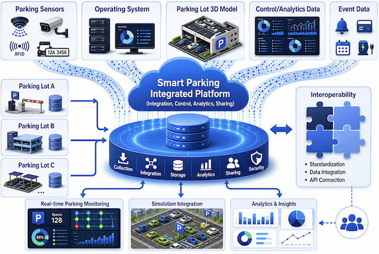

# DTP (Digital Twin Platform)

## Overview
DTP is ETRI's Digital Twin Platform for smart mobility use cases. It is an I2DT platform that manages digital twin objects, collects real-time Thing data, stores and validates schema-based data, supports interoperability between heterogeneous digital twins, and provides dashboard and API functions for monitoring and data access.

The current repository is organized as a public documentation and structure repository for the prototype. The implementation is closed source; component folders represent the intended system modules and deployment areas.



## Architecture
DTP is designed around three cooperating parts:

1. Main I2DT solution
   - Digital Twin Data (DTD) subsystem for Thing data collection, storage, schema management, data browsing, and monitoring.
   - Interoperability Support System (ISS) subsystem for data transformation, API gateway functions, routing rules, endpoint management, and transformation logs.
   - Local Ditto/DTT connection layer for receiving Thing events.
   - Message bus for real-time event delivery between DTD and ISS services.
   - Dashboard layer for monitoring endpoints, transformation rules, data conversion status, and system operation.
   - AI/intelligence layer for use-case-specific analysis.

2. Local Eclipse Ditto instance
   - Acts as the local DTT middleware.
   - Manages Things representing facilities, zones, parking spaces, vehicles, sensors, equipment, and other mobility objects.
   - Publishes events when Thing state changes.
   - Connects to DTP through supported protocols such as HTTP, MQTT, or WebSocket.

3. Additional digital twin / sub-platform
   - Generates, manages, or simulates parking-related data.
   - Updates Things in the local Ditto instance.
   - May exchange model outputs or federated-learning updates with the main platform.

## Inputs
- Real-time digital twin events from the local Ditto/DTT instance.
- Thing schemas, attributes, features, and metadata.
- Data transformation rules between source and target schemas.
- Endpoint and routing information for connected digital twins or external services.

## Outputs
- Stored and managed digital twin data.
- Validated Thing attributes, features, and event histories.
- Transformed data for connected digital twins or external systems.
- API responses for data browsing, schema management, and monitoring.
- Dashboard visualizations of digital twin status, transformation rules, endpoints, and system operation.
- Logs for transformation, routing, endpoint communication, and system monitoring.

## Repository Structure
This repository contains eight top-level documentation areas:

- [01-platforms](01-platforms/README.md): main DTP platform and sub-platform structure.
- [02-apis](02-apis/README.md): DTD and ISS API areas.
- [03-protocols](03-protocols/README.md): messaging protocols and Thing model/protocol descriptions.
- [04-opensources](04-opensources/README.md): open-source component and license inventory.
- [05-simulations](05-simulations/README.md): simulation and test-data generation areas.
- [06-security](06-security/README.md): security requirements, threat model, and deployment guidance.
- [07-applications](07-applications/README.md): DTD and ISS web application areas.
- [08-deployments](08-deployments/README.md): deployment structure for broker, Ditto, platform, storage, monitoring, and related services.

Current folder layout:

```text
.
|-- 01-platforms/
|   |-- main/
|   `-- sub/
|-- 02-apis/
|   |-- dtd-api/
|   `-- iss-api/
|-- 03-protocols/
|   |-- messaging/
|   `-- model/
|-- 04-opensources/
|-- 05-simulations/
|   |-- carla/
|   `-- node-red/
|-- 06-security/
|-- 07-applications/
|   |-- dtd-web/
|   `-- iss-web/
`-- 08-deployments/
    |-- broker/
    |-- ditto/
    |-- monitoring/
    |-- others/
    |-- platform/
    `-- storage/
```

## Prototype Use Flow
1. Deploy DTP components: DTD subsystem, ISS subsystem, dashboard services, message bus, database services, and AI/intelligence service.
2. Deploy and configure the local Eclipse Ditto instance.
3. Register Thing schemas for the target use case, such as parking spaces, vehicles, sensors, zones, facilities, or equipment.
4. Connect physical sensors, simulators, or a sub-platform to Ditto.
5. Register the required DTT/Ditto connection information in DTP.
6. Configure ISS transformation rules by defining mappings between source and target schemas.
7. Register API endpoints and routing rules for connected digital twins, sub-platforms, or external services.
8. Start data generation or collection from the sub-platform, sensor, or simulator layer.
9. Monitor Thing events, stored data, transformation results, endpoint status, and logs through the dashboard.
10. Run the AI/intelligence service to analyze live and historical data.

## Smart Parking Use Case
The reference use case is smart parking. The platform can support:

- parking-space occupancy estimation;
- future occupancy prediction;
- anomaly detection in incoming data;
- parking status classification;
- intelligent recommendations for routing or control;
- exchange of raw data, transformed data, inference results, model outputs, or federated-learning updates between connected digital twins.

## Tool Information
- Version: 0.1, prototype version.
- Type: Closed source. See [LICENSE](LICENSE).
- Source code (authorized access only): [github.com/etri-i2dt/dtp-src](https://github.com/etri-i2dt/dtp-src)
- Web: Deployed at ETRI server.
  - DTD Web: [dtd-dashboard.129.254.222.205.nip.io:20080](http://dtd-dashboard.129.254.222.205.nip.io:20080/)
  - ISS Web: [issui.129.254.222.213.nip.io:20080](http://issui.129.254.222.213.nip.io:20080/)
- For source code requests or platform access, contact Yangkoo Lee (yk_lee[at]etri.re.kr) or Jiwoo Han (chau[at]etri.re.kr).

